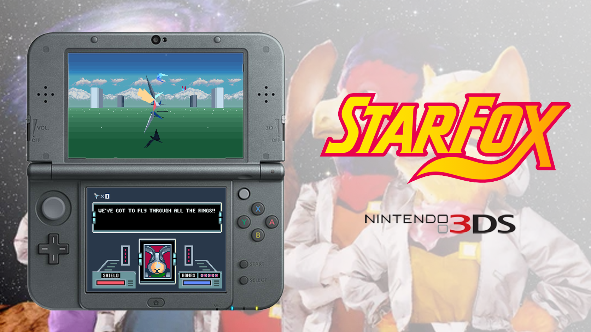

# Starwing 3DS

Nintendo 3DS adaptation of **Star Fox / Starwing for the Super Nintendo**, based
on Starfox Enhanced, UltraStarFox, and the Star Fox EX source work.

Made with help from Codex.

This project is based on work from:

- [KandoWontU's Starfox Enhanced](https://github.com/kandowontu/starfox-enhanced)
  — native C++ engine and the Original / EX runtime.
- [UltraStarFox](https://github.com/Sunlitspace542/ultrastarfox)
  — original-game reconstruction, research, tools, and source mechanics.
- Team SFEX — Star Fox EX mechanics, levels, and tools; individual credits
  are preserved in [CREDITS.md](CREDITS.md).

No ROM, ROM fragment, extracted cartridge graphics, game asset bundle, save,
firmware, or diagnostic memory dump is distributed in this repository. Users
must supply their own legally obtained compatible SNES ROM and the private
build inputs described in the [build guide](docs/BUILDING.md).

## Community

Join my Discord for project updates, support, bug reports, testing, suggestions,
and other Nintendo 3DS homebrew projects:

https://discord.gg/SMW49UMkw

## Features

- Original Star Fox and Star Fox EX selection with a clean-ROM picker.
- Native 400x240 top-screen presentation and a separate 320x240 touch interface.
- CPU simulation and world rasterization, with PICA200/Citro2D presentation and
  eligible Mode 2 BG2 background composition.
- Original source logic near 20 Hz, with a separate 60 Hz presentation target.
- Experimental 3D slider support during wide Mode 2 gameplay and training;
  other screens retain flat presentation.
- Circle Pad and D-pad movement, SNES button mapping, and touch options.
- Native SPC audio, persistent display/audio/developer options, EX SRAM, and
  optional per-game autosave checkpoints.
- Quick diagnostics, full private memory captures, and hardware-dump analysis.

## Installation

1. Install the Starwing 3DS CIA with FBI (for example,
   `Starwing-3DS-vX.cia`, where `X` is the version number).
2. Create `/3ds/Starwing/` on your SD card.
3. Put your compatible, clean `.sfc` or `.smc` ROM in that folder. Any filename
   with one of those extensions can be selected. First launch constructs and
   checks `Starfox-Assets.BIN` locally; matching existing bundles can be reused.
4. Original starts by default. Use **Options > Game Version** to choose Original
   or Star Fox EX and confirm the restart; **ROM Files** selects the source ROM.
   **Star Fox EX is not 100% supported**, as I have not worked on it yet.

Supported inputs are Star Fox Japan 1.0/1.1, USA 1.0/1.1/1.2, Starwing Europe
1.0/1.1, and Germany 1.0. The unheadered file is exactly 1,048,576 bytes; a
512-byte copier header is accepted. Revisions are checked by CRC32 in
[rom_probe.c](platform/3ds/source/rom_probe.c). Modified or unknown ROMs are
rejected. No ROM download links are provided.

## Controls

| Nintendo 3DS input | Action |
|---|---|
| Circle Pad / D-pad | SNES directional movement; D-pad takes priority |
| A / B / X / Y | Corresponding SNES buttons |
| L / R | SNES shoulder buttons |
| START / SELECT | Corresponding SNES controls, subject to developer shortcuts |
| Touch screen | Options, game selection, and diagnostic controls |
| 3D slider | Experimental depth during eligible wide gameplay / training |

Options are stored in `sdmc:/3ds/Starwing/options.cfg`. Defaults are wide display
on, top HUD on, volume 100, autosave off, FPS off, and developer overlay off.
With the application closed, renaming `options.cfg` restores defaults on the
next start. Keep the ROM, asset bundles, EX SRAM, and autosaves when upgrading.
HOME, sleep, close, and restart behavior still require physical validation for
the current build.

## Diagnostics and bug reports

- **L + R + A:** quick diagnostic capture.
- **L + R + B:** full memory capture; keep the complete capture private.
- **L + R + X:** delete Starwing diagnostic folders, including unfinished
  `.partial` captures. This is a destructive shortcut.
- **L + R + SELECT:** toggle the diagnostic overlay.

Dumps are saved under `sdmc:/3ds/Starwing/dumps/`. A complete capture ends with a
manifest and `COMPLETE` marker. Interrupted captures retain `.partial`.
Use `python3 platform/3ds/tools/analyze-hardware-dump.py <Starwing-folder>`
to inspect them locally.

When reporting a bug, include the build, console model, Original/EX selection,
ROM revision, scene, settings, and steps to reproduce it. Review screenshots,
`runtime.json`, and performance summaries before sharing. Do not post your ROM,
asset bundle, saves, full memory pages, private paths, or complete dump archive
in a public issue.

## Building

See [docs/BUILDING.md](docs/BUILDING.md) for the pinned engine,
devkitPro/devkitARM dependencies, private input paths, separate
3DSX/CIA stages, and ROM-free host checks. The existing CMake build and engine
architecture are preserved; this is not a Star Fox 64 or Nintendo 64 project.

## Credits

- KandoWontU, UltraStarFox, and Team SFEX — engine, reconstruction, EX, research,
  tools, and upstream work; individual credits are in [CREDITS.md](CREDITS.md).
- Nintendo and Argonaut Software — the original Star Fox / Starwing.
- devkitPro contributors — devkitARM, libctru, Citro3D, and Citro2D.
- Esteban PDN — Nintendo 3DS adaptation and repository maintenance.

## License and legal notice

Third-party components retain their own licenses and notices. See
[THIRD_PARTY_NOTICES.md](THIRD_PARTY_NOTICES.md) and the vendored
[Citro2D license](platform/3ds/vendor/citro2d/LICENSE). No blanket MIT or GPL
license is assigned to the whole project. The native engine is republished with permission confirmed by the repository
maintainer. Its inspected checkout has no general root license; this permission
does not assign a new blanket license or extend to Nintendo game data.

Nintendo owns Star Fox / Starwing and its game content. This is an unofficial
fan project and is not affiliated with or endorsed by Nintendo. The showcase
image is illustrative project artwork; it does not license the depicted game
or trademark assets for redistribution.
